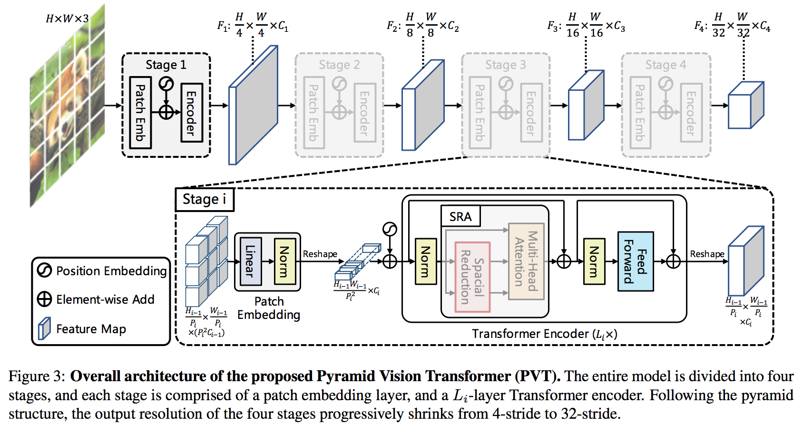
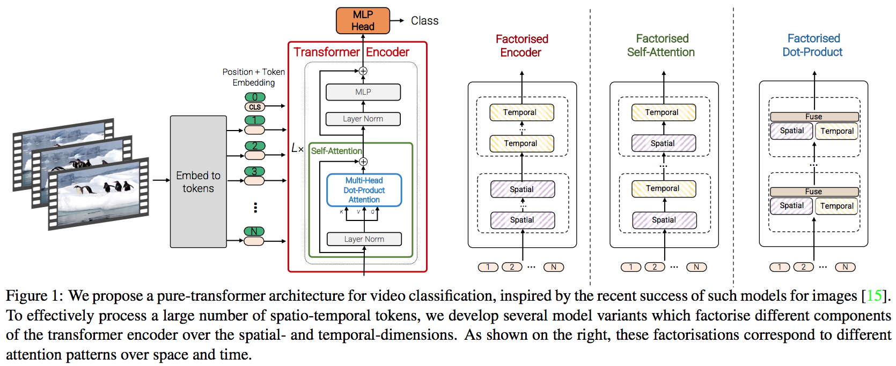

Video Transformers Paper and Notes
=======
## Best view by exporting .md to PDF or in .md editor such as VScode, MacDown in order to support Math formula
# Some Transformer basics
1. [3W字长文带你轻松入门视觉transformer](https://zhuanlan.zhihu.com/p/308301901) (Chinese)

# Video Transformers
## [(ICML 2021) Is Space-Time Attention All You Need for Video Understanding?](https://arxiv.org/pdf/2102.05095.pdf)
Code: [mmaction](https://github.com/open-mmlab/mmaction2/blob/master/configs/recognition/timesformer/README.md), [Official](https://github.com/facebookresearch/TimeSformer), [Popular one](https://github.com/lucidrains/TimeSformer-pytorch)

</img> 

</img>

### Overview
This paper proposes Divided Space-Time Attention (T+S) operation for the standard Transformer architecture ([ViT backbone](https://arxiv.org/pdf/2010.11929.pdf) is adapted for videos). As seen in Fig. 2, T+S calculates 1) temporal attention for **only** current patch (marked in blue) and the same location patch at different time stamps, and 2) the spatial attention for each patch in each frame. 

### Details from [Official code](https://github.com/facebookresearch/TimeSformer):
Given a video clip input $\mathbf{X}\in \mathbb{R}^{B\times C\times T\times H\times W}$.

1) PatchEmbed (image to patch embedding): each frame is decomposed into $N$ size of $P\times P$ patches ($N=\frac{H\times W}{P^2}$, $P=16$ in this work, 2D convolution operates on each patch to get linear emebedding). Then flatten over spatial and time: $\mathbf{X}\in \mathbb{R}^{(B*T)\times (N+1)\times D}$ ($D$ is the output channel of first 2D convolution); 

2) Spatial position encoding: Add *cls_token* $\to$ $\mathbf{X}\in \mathbb{R}^{(B*T)\times (N+1)\times D}$, then add postion encoding;

3) Temporal embedding: Extract temporal *cls_tokens = X[:B, 0:1, :]*. Operate temporal position encoding on $\mathbf{X}\in \mathbb{R}^{(B*N)\times T\times D}$ and rearange back to $\mathbf{X}\in \mathbb{R}^{B\times (N*T)\times D}$. Add temporal *cls_tokens* to get $\mathbf{X}\in \mathbb{R}^{B\times (N*T+1)\times D}$

4) Temporal attention and spatial attention: It should be noted that process *cls_token* for temporal and spatial respectively. 1) Temporal attention: $\mathbf{X}\in \mathbb{R}^{(B*N)\times T\times D}$; 2) Spatial attention: $\mathbf{X}\in \mathbb{R}^{(B*T)\times N\times D}$. 
   
Performance: K400 78.0, SSv2 59.5 ($8\times 224\times 224$ video clips).

## [(ICML 2021) Perceiver: General Perception with Iterative Attention](https://arxiv.org/pdf/2103.03206.pdf)
Code: [PyTorch](https://github.com/lucidrains/perceiver-pytorch)

[Explaination: Yannic Kilcher YouTube](https://www.youtube.com/watch?v=P_xeshTnPZg&ab_channel=YannicKilcher)

</img>

### Overview
This paper introduces a general transformer model *Perceiver* with few architectural assumptions about the relationship between its inputs i.e., can be used for many input types such as images, texts. The model leverages an asymmetric attention mechanism to iteratively distill inputs into a tight latent bottleneck, allowing it to scale to handle very large inputs. 

*Perceiver* generalizes the input by treating the input (big data like an image) as **Byte array (K, V)** as seen in the figure above. The **Latent array (Q)** (small) is **randomly initialized** and used for learning the feature from the **Byte array**. It should be noted that only **Q** is updated and fed to the next stage. The same **Byte array (K, V)** is used in the next stage. This is how *"iterative learning"* for the input mentioned in the paper. 

### Problems and Solutions
It can be noticed the iterative learning mentioned above is very computationally expensive regarding the cross attention between (Q, K, V). Suppose we have $K,V\in \mathbb{R}^{M\times D}$ and $Q\in \mathbb{R}^{M\times C}$, softmax$(QK^\top)V$ is $O(M^2)$. A $224\times 224\times 3$ image input will have $M$~150k. So this work project (Q, K, V) into lower dimension $N$ firstly. Then do the cross attention operation. The output is fed to the next latent transformer (do the self-attention).

## [(MSRA) Swin Transformer: Hierarchical Vision Transformer using Shifted Windows](https://arxiv.org/pdf/2103.14030.pdf)
Code: [Official PyTorch](https://github.com/microsoft/Swin-Transformer)

[Explaination: SOTA模型Swin Transformer是如何炼成的](https://zhuanlan.zhihu.com/p/376486858)

</img>

### Overview
Direct transforming the transformer from langauge tasks to vision tasks causes problems such as heavy computation due to long patch tokens. This paper tackles this side by 1) patch merging layer concatenates the features of each group of $2\times 2$ neighboring patches to reduce resolution in a hierarchical manner (**reduce the patch token length**), and applies a linear layer on the 4C-dimensional concatenated features, and 2) self-attention computation in the partitioned windows as seen in Fig. 3. The second operation can be achieved by partitioning patches into several windows i.e., window multi-head self-attention (W-MSA), in which self-attention is applied inside windows and parameters are shared by different windows.  

### Shifted Windows
Splitted window operation is able to significantly reduce the computation, but it only focuses on the local attention and ignores the global field. The author overcome this by adding a shifted window multi-head self-attention (SW-MSA) after a W-MSA block. As seen in Fig. 2, each window in Layer 1 is shifted by $\pm\delta$ in the next layer. The extra computation is caused by this operation since there are 9 tokens compared to 4 tokens in the previous stage. The authors proposes the cyclic shift as seen in Fig. 4 to avoid this extra computation. The A, B, and C are moved to the down right, which now construct four windows same as pervious W-MSA. The calculated self-attention can be masked before the output.

</img>  </img>

## [(MSRA) Video Swin Transformer](https://arxiv.org/pdf/2106.13230.pdf)
Code: [Official](https://github.com/SwinTransformer/Video-Swin-Transformer)

</img>

### Overview
Video Swin Transformer is proposed beyond [Swin Transformer](https://arxiv.org/pdf/2103.14030.pdf) proposed for images. The main modification of Video Swin Transformer is replacing the 2D shifted window by using the 3D shifted window as seen in Fig. 3. Also the input video is first processed by a 3D convolution to get path tokens, which can be noticed that input sequence is downsampled by two regarding the temporal dimension.

</img>

### Some Thoughts
1) Even the Video Swin Transformer has achieved the SOTA in several benchmarking results, the computation is still very heavy. The self-attention computation inside the 3D local window is $(\frac{T}{2})^2$ times of Swin Transformer. Is that possible to do the self-attention by treating spatial and temproal aspects separately. 

2) The 3D shifted window seems do not boost the performance that much in ablation study. Only 0.3% better than using the original Swin Transformer. 

3) Does Video Swin Transformer good enough to catch the long-term temporal information?

## [Pyramid Vision Transformer: A Versatile Backbone for Dense Prediction without Convolutions](https://arxiv.org/pdf/2102.12122.pdf)
Code: [Official](https://github.com/whai362/PVT)

</img>

### Overview
Unlike the recently-proposed Transformer model (e.g., ViT) that is specially designed for image classification, Pyramid Vision Transformer (PVT) is designed similar to Swin Transformer in a hierarchical manner to overcome the difficulties of porting Transformer to various dense prediction tasks. As seen in Fig. 3, it can be seen that feature map is reduced at each stage, which is able to 1) reduce feature map resolution, and 2) reduce the computation when computing the self-attention. It should be noted that each **Patch Emb** operation contains a 2D convolution layer to reduce the feature map. In order to reduce the self-attention computation, **Spatial Reduction** is applied before the Multi-head Attention. 

## [Improved Pyramid Vision Transformer](https://arxiv.org/pdf/2106.13797.pdf)
Code: [Official](https://github.com/whai362/PVT)

[Explaination](https://mp.weixin.qq.com/s?__biz=MzUxNjcxMjQxNg%3D%3D&chksm=f9a11932ced690247c151ea5355bb654d5dd10ece8bb5d09f7ccf360f88233453881ae7ca81c&idx=3&mid=2247527357&scene=21&sn=4260af27ae82651d59f9dce179bc03b5#wechat_redirect)

</img>

### Overview
Improved version PVT by introducing **overlapping patch embedding**. As seen in Fig. 1, PVTv2 increases kernel size in 2D convolution layer from $P$ to $2P-1$, and keeps the stride unchanged ($P$). Zero padding is applied (padding size is $P-1$). This overlappng operation works very similar to the shifted window operation in Swin Transformer, which aims to get interaction between pixels in each neighbouring patches.

## [(ICCV 2021) VidTr: Video Transformer Without Convolutions](https://arxiv.org/pdf/2104.11746.pdf)

Code: To be added 

</img>

### Overview
Similar to [ViT](https://arxiv.org/pdf/2010.11929.pdf) and [Perceiver]((https://arxiv.org/pdf/2103.03206.pdf)), VidTr is a convolution free Transformer backbone. The core part of VidTr is similar to other Video Transformers i.e., to reduce the **self-attention computation** in spatio-temporal domain.

### Problems and Solutions
Given an extra dimension $T$ upon the image, the spatio-temporal attention computation is $O(T^2\times H^2\times W^2)$, which is $T^2$ times of images regarding ViT. As seen in Fig. 2, VidTr adopts separable attention $MSA(S)=MSA_s(MSA_t(S))$. Moreover, the temporal dimension is downsampled (downsample strategy can be referred in Table 4(d) in the original paper) in the temporal attention from $T$ to $\tau$, which decreases self-attention computation in ViT from $O(T^2\times H^2\times W^2)$ to $O(\tau^2+H^2\times W^2)$. The overall modification is straightforward and Kinetics results are close to the hierarchical Transformer family (i.e., PVT, Swin Transformer). 

However, the performance on SSv2 is worse than normal 2D CNN + efficient module design strategies, which indicates the temporal modelling ability in VidTr is sort of limited.

## [*(DAMO Alibaba) An Image is Worth 16x16 Words, What is a Video Worth?](https://arxiv.org/pdf/2103.13915.pdf)

Code: [Official PyTorch](https://github.com/Alibaba-MIIL/STAM), [lucidrains](https://github.com/lucidrains/STAM-pytorch)

</img>

### Overview
Similar to [TimeSformer](https://arxiv.org/pdf/2102.05095.pdf), this works focuses on spatio-temporal modelling for Transformer architecture and propose the Space Time Attention Model (STAM). In [TimeSformer](https://arxiv.org/pdf/2102.05095.pdf), the authors performed a temporal attention followed by a spatial attention in a sequential manner. In this work, the authors argue that temporal Transformer performing beyond the spatial embbeinding is able to fully activate sequential modelling ability for the Transformer. Different from previous works, this work first extract spatial embedding for each patch in each frame and temporal Transformer is **only** applied before the classfication head **instead of mixing temporal and spatial modelling in each layer in Transformer**. In details, the main pipeline of STAM is $\mathbf{X}\to $spatial Transformer $\to$ linearly projected onto a patch embedding space $\to$ temporal Transformer. The overall computation of the self-attention is $O(FN^2+F^2)$, where $F$ is the number of frames and $N$ is the number of pathes in each frame.

### Some Thoughts
* The idea of this work is good and pretty makes sense to me i.e., barrow the Transformer's strong sequention ablity beyond the spatial embedding. It is pretty like treats spatial Transformer like ordinary CNN backbone to extract features and then reason the temporal information for those extracted features. This is able to avoid that ***a series of 3D-convolutions can learn long-term interactions due to increased receptive field, they are biased towards local ones***.
* More studies can be carried out regarding the temporal datasets such SSv2. 

## [*(Google) ViViT: A Video Vision Transformer](https://arxiv.org/pdf/2103.15691.pdf)

Code: [Unofficial PyTorch](https://github.com/rishikksh20/ViViT-pytorch)

</img>

### Overview

This works propose several, efficient variants of our model which factorise the spatial and temporal dimensions of the input. 

* Patch Embedding

	First, the authors compare two sampling approaches as seen in Fig. 2 and Fig. 3. The uniform frame sampling is to embed each 2D frame independently using the same method as ViT, and and concatenate all these tokens together. In terms of the tubelet embedding, it extracts non-overlapping, spatio-temporal “tubes” from the input volume, and to linearly project this to $\mathbb{R}^d$. This method fuses spatio-temporal information during tokenisation, in contrast to “Uniform frame sampling” where temporal information from different frames is fused by the transformer.

</img>

* Transformer Variants

	1) **Model 1: Spatio-temporal attention** &nbsp; &nbsp; This model simply forwards all spatio-temporal tokens extracted from the video, which is the same as "Joint Space-Time model" in [TimeSformer](https://arxiv.org/pdf/2102.05095.pdf). 
	
	2) **Model 2: Factorised encoder** &nbsp; &nbsp; As seen in Fig. 4, this can treated similarly as [STAM](https://arxiv.org/pdf/2103.13915.pdf).

</img>

	3) **Model 3: Factorised self-attention** &nbsp; &nbsp; This model, in contrast, contains the same number of transformer layers as Model 1. However, instead of computing multi-headed self-attention across all pairs of tokens, $\mathbf{z}^l$, at layer $l$, the authors factorise the operation to first only compute self-attention spatially (among all tokens extracted from the same temporal index), and then temporally (among all tokens extracted from the same spatial index) as shown in Fig. 5, which is [TimeSformer](https://arxiv.org/pdf/2102.05095.pdf) reversing the order of temporal attention and spatial attention.

</img>

	4) **Model 4: Factorised dot-product attention** &nbsp; &nbsp; Finally, the authors develop a model which has the same computational complexity as Models 2 and 3, while retaining the same number of parameters as the unfactorised Model 1 as seen Fig. 5. Concretely, the authors compute attention weights for each token separately over the spatialand temporal-dimensions using different heads, then concatenate spatial self-attention and temporal self-attention outputs. 
	
</img>

### Some Conclusion
The authors find that the **Model 1** performs best on large-scale datasets such as K400 but tends to overfit more on smaller datasets. The **Model 1** requires more computation compared to others. It can be seen that [STAM](https://arxiv.org/pdf/2103.13915.pdf) style seems to be more efficient i.e., good accuracy and lighter computation.
	
</img>

